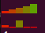

<p align="center">
	
</p>

<h1 align="center">Finessing Finance</h1>

<p align="center">
	<strong>Explore the world of managine finances! Yippee!!!</strong>
</p>

## 🚀 Overview

Welcome to **Finessing Finance**! This program is designed to help you manage your finances. The program will help you learn about investing in the stock market and budgeting your income (through deposits and investing).

> [!NOTE]
> The following command will show the manual for the program: `man ./finessing_finance.1`.

## 🎨 Features

- **Investing Account:** Besides the regular account to for depositing and withdrawing money, there is also an investing account which is automatically created when the user buy and sell stocks.
- **Simulated Stock Market:** The program simulates the stock market by fluctuating the stock prices for each stock using randomly generated values.
- **ASCII Art:** "Finance Simulator" ASCII art logo.
- **Graph Visualization:** Visualize stock prices' fluctuations using a colored graph in the terminal.

## 📝 TO-DO

- [ ] Fix casting account to investing account.
	- Not working properly because user loses stocks.
- [ ] Fix graph visualization.
	- Graph digits on x-axis are not aligned with the graph once double digits are present.
	- All graphs go white after about 15 updated stock prices.
- [ ] Add text coloring.
- [ ] Generate financial reports.
- [ ] Apply taxes to income based on state.

## 🛠️ Installation

To get started with the program, follow the steps below:

1. **Clone the Repository**
```sh
git clone https://github.com/321BadgerCode/finessing_finance.git
cd ./finessing_finance/
```

2. **Compile the Program**
```sh
g++ ./main.cpp -o ./finessing_finance
```

## 📈 Usage

To use the program, there is only **one** step!

1. **Run the program**
```sh
./finessing_finance [options]
```

<details>

<summary>💻 Command Line Arguments</summary>

**Command Line Arguments**:
|	**Argument**		|	**Description**	|	**Default**	|
|	:---:			|	:---:		|	:---:		|
|	`-h & --help`		|	Help menu	|			|
|	`--version`		|	Version number	|			|

</details>

## 📸 Screenshots

**The stock market displays fluctuations in stock prices using bar graphs for each individual stock.**
<p align="center">
	
	
</p>

---

**The stock market also displays fluctuations in stock prices using line graphs where each individual stock is a differently colored line. The colors are automatically generated, so you can add many more stocks to the stock list and the stock market graph visualization will scale in accordance.**
<p align="center">
	
	
</p>

> [!WARNING]
> Other than the problems with the graph visualizations already listed in [TO-DO](#-to-do), the line graph visualization also is not perfectly symmetrical as you can tell. The colors mix when they intersect and you can tell that the middle should be white as all of the colors are intersecting. However, the white point looks off-center, because the pixels for different characters are different and I have not created a dynamic system yet to scale the graph in accordance to this. **Also**, the there is a bug where the black lines appear. I haven't gotten to fixing that bug yet. The black lines do not appear if I exclude the code line `graph.resize(10, 10, true);`, so I think the bug derives from the resizing of the graph points.

<p align="center">
	
	
</p>

## 📜 License

[LICENSE](./LICENSE)